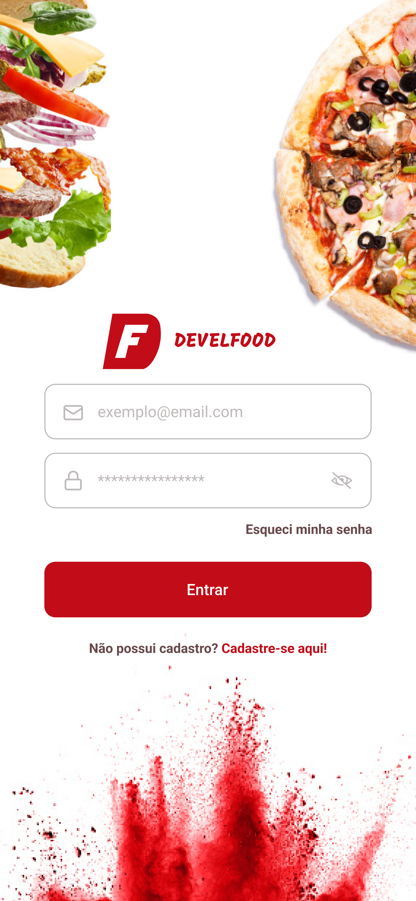
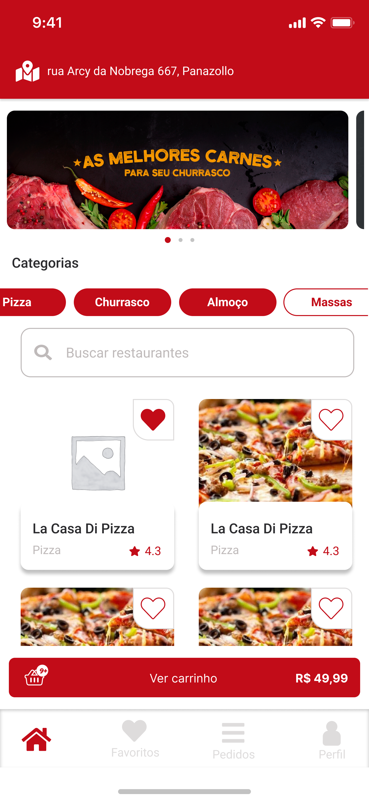
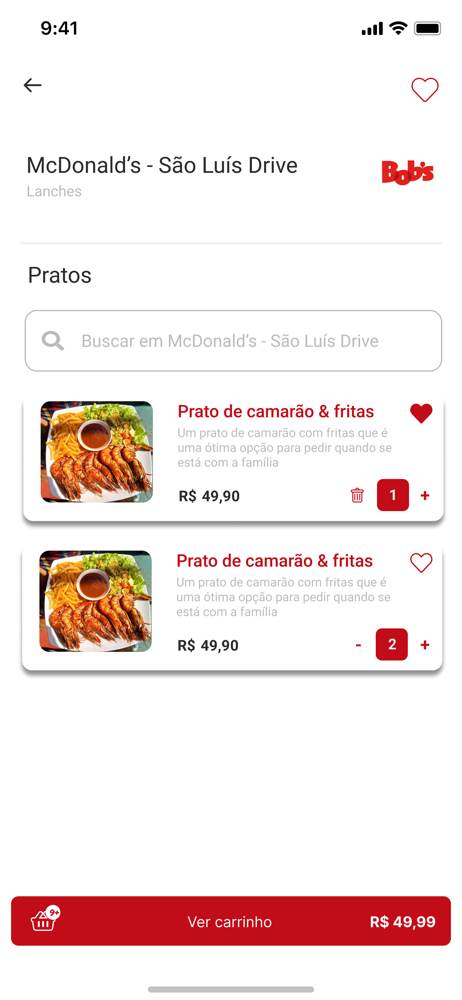
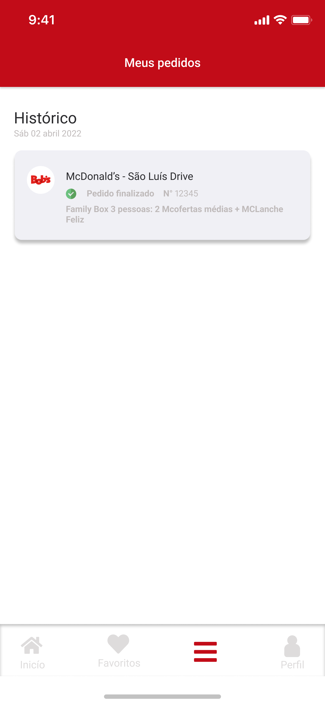

<h1 align="center">
  
</h1>

Um aplicativo de delivery completo e eficiente.

  <a href="#plate_with_cutlery-plataforma">Plataforma</a> •
  <a href="#crab-layout">Layout</a> •
  <a href="#computer-tecnologias">Tecnologias</a> •
  <a href="#chains-licenc-a">Licença</a> 

## :plate_with_cutlery: Plataforma

A plataforma mobile da Develfood permite ao usuário consumidor gerenciar todo o fluxo de delivery de comida:

- Cadastro e edição do usuário e suas informações: nome, endereço, telefone, e-mail, senha, etc;
- Realizar o pedido de comida: escolher o restaurante, o prato, a quantidade e vizualizar o status do pedido em tempo real;
- Visualizar todos os pedidos do usuário;
- Favoritar pratos;

## :art: Layout

  
  
  
  

## :computer: Tecnologias

As ferramentas utilizadas na construção do projeto foram:

- [React Native](https://reactnative.dev/)
- [TypeScript](https://www.typescriptlang.org/)

## :chains: Licença

Este projeto está sob a licença MIT.
